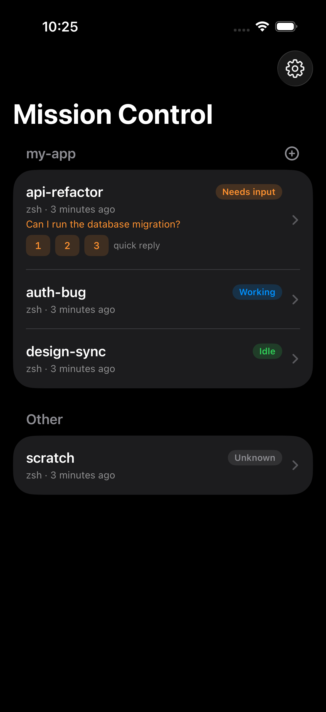
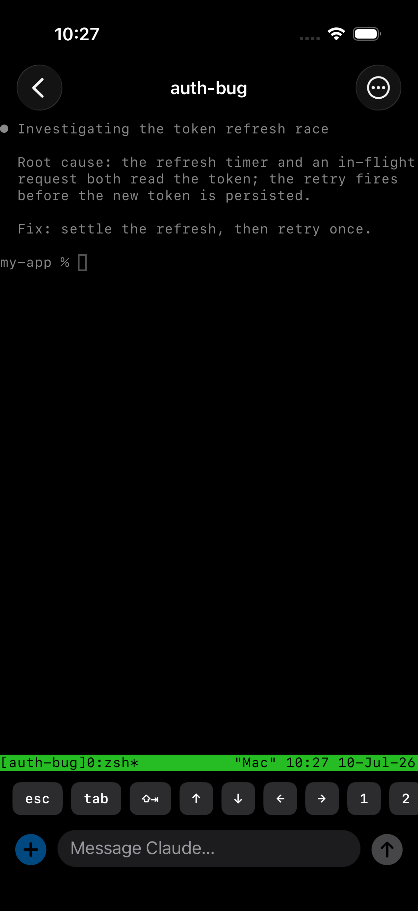

# Mission Control

A native iOS remote for a fleet of [Claude Code](https://claude.com/claude-code)
sessions running in `tmux` on your Mac. Check what every session is doing, get a
push when one needs you, drop into a live terminal, and send a message (or a
photo) — all over your private
[Tailscale](https://tailscale.com) network.

It replaces Claude Code's built-in remote control for people who run many
long-lived sessions on one always-on machine. The design principle: **the source
of truth never leaves the Mac.** The terminal is streamed straight from
`tmux attach`, and input is injected locally with `tmux send-keys` — so there's
no mirrored state to go stale and no keystrokes to drop in a sync layer.

<table>
  <tr>
    <td></td>
    <td></td>
  </tr>
</table>

## How it works

```
┌──────────────┐   Tailscale (WireGuard)   ┌─────────────────────────────┐
│  iOS app     │ ◄──────────────────────►  │  Mac                        │
│  (SwiftUI +  │   REST + WebSocket        │  server/ (Node, launchd)    │
│   SwiftTerm) │                           │    ├─ tmux ls / send-keys   │
└──────────────┘                           │    ├─ PTY ↔ WS streaming    │
      ▲                                    │    ├─ event registry        │
      │ ntfy push                          │    └─ ntfy notifier          │
      └────────────────────────────────────│  hooks/ (Claude Code hooks) │
                                           └─────────────────────────────┘
```

- **`server/`** — a small Node/TypeScript daemon. Lists tmux sessions with
  status, streams panes over a PTY-backed WebSocket (feeds SwiftTerm), injects
  input and copy-mode scrolls via `tmux send-keys`, kills sessions, resolves
  per-session links (claude.ai / GitHub PR) and git worktrees, manages
  workspaces, stores uploaded media, and sends notifications via ntfy.
- **`server/hooks/mc-hook.sh`** — Claude Code hooks (SessionStart /
  UserPromptSubmit / Notification / Stop) that report each session's state to the
  server. Every Claude Code session running inside tmux reports automatically.
- **`ios/`** — the SwiftUI app (built with [XcodeGen](https://github.com/yonaskolb/XcodeGen)).
- **`deploy/`** — one setup script for the Mac (launchd + hooks + `tailscale serve`).

## Features

- **Multiple servers** — connect to more than one Mac (e.g. a desktop and a
  laptop) and switch between them from the top bar.
- **Fleet view** — every session with a status chip (working / needs input /
  idle), a live output preview, and sessions waiting on you sorted to the top.
- **Workspaces** — group sessions by the project directory they run in; tap **+**
  to open a fresh shell there.
- **Live terminal** — real `tmux attach` rendered by SwiftTerm, with a native
  input bar, a quick-key row (Esc / Tab / arrows / digits / Ctrl-C),
  pinch-to-zoom, and touch or trackpad scrolling through tmux history.
- **Agent-style composer** — type `@` to tag a project file or `/` to find an
  installed skill; suggestions follow the editor cursor rather than only the
  end of the message.
- **Media** — paste an image into the field or pick a photo/video; it uploads to
  the Mac and its path is sent so Claude can read it.
- **Per-session actions** — open the conversation in claude.ai, view its GitHub
  PR, search terminal history, review activity, mute or resume notifications,
  rename the session, save its directory as a workspace, or kill it (with an
  offer to clean up the git worktree).
- **Mac app** — the same target builds for macOS via Mac Catalyst: one codebase,
  and workspaces/sessions are served by the server so every device sees the same
  thing. While the Mac app is running (even in the background) notifications
  arrive as native macOS banners and the phone stays quiet; quit it and pushes
  fall back to the phone automatically. The Mac uses a two-pane layout, supports
  Command-Return to send, Command-[ / Command-] to navigate history,
  Command-K to jump directly to a session, and Command-Option-S to toggle the
  sidebar. The terminal toolbar explicitly checks the current branch for an
  open PR, then changes to a distinct green **Open PR** control when one exists.
- **Action feedback** — success, information, and error toasts make connection,
  PR, terminal-scroll, and server-update outcomes visible without interrupting
  the terminal.
- **Resilient** — the terminal auto-reconnects with backoff; because tmux holds
  the session, reconnecting just re-attaches.

## Prerequisites

- A Mac that stays on, with [Homebrew](https://brew.sh), Node 20+, `tmux`, `git`,
  and the [GitHub CLI](https://cli.github.com) (`gh`, authenticated — for the
  "view PR" action).
- [Tailscale](https://tailscale.com) installed and logged in on both the Mac and
  your iPhone (same tailnet).
- Xcode 16+ (a free Apple ID is enough to build on your own device — no paid
  Developer Program needed).
- The free [ntfy](https://ntfy.sh) app on your iPhone, for notifications.

## Setup

### 1. Server (on the Mac)

```sh
git clone <this-repo> ~/mission-control
cd ~/mission-control
./deploy/setup.sh
```

The script builds the server, installs it as a launchd service (auto-starts on
login), registers the Claude Code hooks, exposes the server on your tailnet with
`tailscale serve`, and prints a **pairing QR** plus the server URL and token.
Reprint the QR anytime with `./deploy/show-pairing.sh`.

After this version is installed, future server updates can be started from the
app on either iPhone or Mac: **Settings → Server maintenance → Update server**.
It performs a fast-forward `git pull`, `npm ci`, a server build, and a launchd
restart. Status is shown in the app; detailed output is saved to
`~/.mission-control/update.log` on the server Mac.

> The first update to a server running an older version still needs a manual
> `git pull`, `npm ci`, `npm run build`, and launchd restart, because that older
> server does not yet expose the authenticated update endpoint.

> The server binds to `127.0.0.1` only — the sole way in is `tailscale serve`
> (tailnet devices only). For TLS, enable HTTPS certificates in the Tailscale
> admin console before running; otherwise it falls back to tailnet HTTP (still
> WireGuard-encrypted).

### 2. iOS app

```sh
cd ios
xcodegen generate
open MissionControl.xcodeproj
```

Copy `ios/Config/Signing.local.xcconfig.example` to
`ios/Config/Signing.local.xcconfig` and set your bundle ID and team there.
That local file is ignored by Git and survives `xcodegen generate`. Then select
your iPhone run destination and build. Tap the **gear → +  → Scan
pairing QR** and scan the QR the setup script printed — that adds the server (no
username or manual token entry). Repeat on another Mac to add a second server;
switch between them from the menu in the top-left.

For the **Mac app**, pick the "My Mac (Mac Catalyst)" run destination instead —
same target, no extra setup. To pair on the Mac, copy the
`missioncontrol://configure` link the setup script prints and use
**gear → + → Paste pairing link** (scanning a QR with the Mac's own camera
would be silly).

### 3. Notifications (ntfy)

Notifications go through [ntfy](https://ntfy.sh) — free, open-source, and no
Apple Developer Program required. The setup script generates a random, private
topic and prints it. On your phone: install the **ntfy** app, add the server
(`https://ntfy.sh` by default), and subscribe to that topic. Done — when a
session needs input or finishes a turn, you get a push, and tapping it opens
that session in Mission Control (via the `missioncontrol://` deep link).

Mission Control suppresses repeated copies of the same hook event. To silence a
noisy session everywhere, use **Unsubscribe from notifications** in its context
menu (or the session's `…` menu); use **Subscribe to notifications** there to
turn them back on.

Keep messages in mind for privacy: with the hosted `ntfy.sh`, notification text
transits their server, so it's kept terse (session name + short reason). For a
fully private setup, self-host ntfy and set `ntfyServer` in
`~/.mission-control/config.json` to your own server.

If the Mac app is running, it holds a WebSocket to each paired server and the
server delivers notifications there instead of ntfy — native banners on the Mac,
nothing on the phone. Quit the Mac app (or let the connection drop) and
notifications fall back to ntfy within about 30 seconds.

## Security

The server shells out to `tmux`/`git`/`gh` only via `execFile` with argument
arrays (never a shell), validates session names, whitelists keys, and is reachable
only over your tailnet behind a bearer token. See [SECURITY.md](SECURITY.md) for
the full threat model and input-handling notes.

## Notes

- **Open in claude.ai** only works for sessions bridged to the cloud (remote
  control / teammate sessions); it reads the bridge id Claude Code records in
  `~/.claude/sessions/`. Local-only sessions have no web URL and the item is hidden.
- **Uploaded media** lives under the OS temp directory, which macOS purges on its
  own — no manual cleanup.
