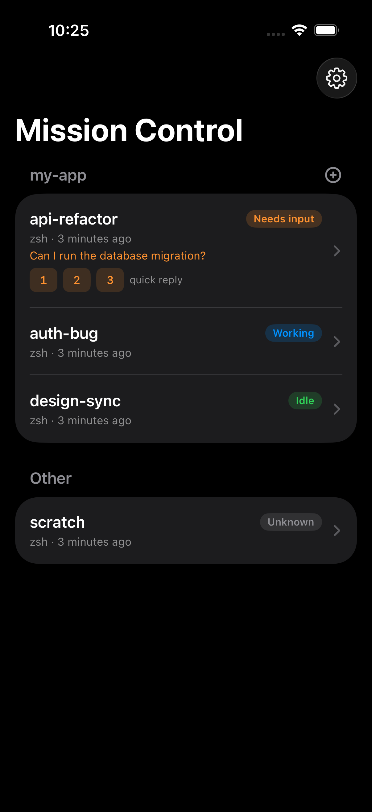
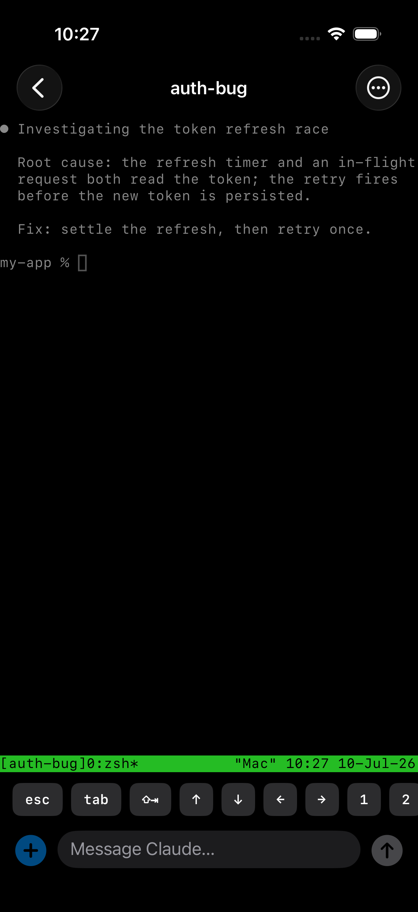

# Mission Control

A native iOS remote for a fleet of [Claude Code](https://claude.com/claude-code)
and [Codex CLI](https://developers.openai.com/codex/cli) sessions running in
`tmux` on your Mac. Check what every session is doing, get a
push when one needs you, drop into a live terminal, and send a message (or a
photo) — all over your private
[Tailscale](https://tailscale.com) network.

It gives people who run many long-lived coding-agent sessions one remote control
on an always-on machine. The design principle: **the source
of truth never leaves the Mac.** The terminal is streamed straight from
`tmux attach`, and input is injected locally with `tmux send-keys` — so there's
no mirrored state to go stale and no keystrokes to drop in a sync layer.

<table>
  <tr>
    <td></td>
    <td></td>
  </tr>
</table>

## How it works

```
┌──────────────┐   Tailscale (WireGuard)   ┌─────────────────────────────┐
│  iOS app     │ ◄──────────────────────►  │  Mac                        │
│  (SwiftUI +  │   REST + WebSocket        │  server/ (Node, launchd)    │
│   SwiftTerm) │                           │    ├─ tmux ls / send-keys   │
└──────────────┘                           │    ├─ PTY ↔ WS streaming    │
      ▲                                    │    ├─ event registry        │
      │ ntfy push                          │    └─ ntfy notifier          │
      └────────────────────────────────────│  hooks/ (agent lifecycle)   │
                                           └─────────────────────────────┘
```

- **`server/`** — a small Node/TypeScript daemon. Lists tmux sessions with
  status, streams panes over a PTY-backed WebSocket (feeds SwiftTerm), injects
  input and copy-mode scrolls via `tmux send-keys`, kills sessions, resolves
  per-session links (claude.ai / GitHub PR) and git worktrees, manages
  workspaces, stores uploaded media, parses transcripts into the conversation
  feed, the decision queue, and per-session context usage, and sends
  notifications via ntfy.
- **`server/hooks/mc-hook.sh`** — shared Claude Code and Codex lifecycle hooks
  that report each session's state to the server. Every configured agent session
  running inside tmux reports automatically. Each event is pushed straight on to
  the connected apps, so the UI tracks an agent as it works rather than polling
  for changes. Claude's `AskUserQuestion` is intercepted before its terminal
  dialog: Mission Control renders the exact structured questions and returns the
  selected answers to the same interactive Claude process. This continues to use
  the user's normal Claude Code subscription; no Agent SDK session is involved.
- **`ios/`** — the SwiftUI app (built with [XcodeGen](https://github.com/yonaskolb/XcodeGen)).
- **`deploy/`** — one setup script for the Mac (launchd + hooks + `tailscale serve`).

## Features

- **Multiple servers** — connect to more than one Mac (e.g. a desktop and a
  laptop) and switch between them from the top bar.
- **Fleet view** — every session with a status chip (working / needs input /
  idle), a live output preview, and sessions waiting on you sorted to the top.
- **Decision queue** — the tray in the top bar collects every session waiting on
  you, across *every* paired server, and badges the count. Each entry carries the
  ask, the tool call it's blocked on, the options if it asked a question, and what
  the agent last said — enough to triage immediately. Permission prompts can be
  approved, denied, or replied to there; structured questions open their native
  Conversation card. Acting advances to the next one. Shift-Command-D on the Mac.
- **Native Claude questions** — single-choice, multi-select, multi-question, and
  free-text `AskUserQuestion` prompts render as first-class Conversation cards.
  Answers are correlated by Claude's tool-use ID instead of terminal cursor
  position. If the blocking hook cannot reach Mission Control, Claude falls back
  to its ordinary terminal dialog and the existing pane parser remains available.
- **Context meter** — how full each supported agent's context window is, read from the
  token accounting in its transcript, with the number of times it has already
  compacted and how much history that discarded. Shown above the conversation and
  in the Mac inspector; fleet cards raise a chip only once a session is actually
  under pressure. Tap it for the rest of the session's configuration — model,
  reasoning effort, permission mode, branch, Claude Code build — all read from
  what Claude Code records as it goes, so none of it needs a slash command whose
  output would only render inside the terminal. A session running in plan mode,
  auto-accepting edits, or with permissions bypassed says so in orange.
- **Repository workspaces** — each workspace is a Git repository's primary
  checkout. Mission Control discovers every linked worktree, groups sessions
  from any checkout together, and opens fresh shells in the primary checkout.
  Use the repository control beside a workspace to inspect branches and paths,
  close one linked worktree or all of them, and choose clean close (refuses
  uncommitted work) or force close (discards it). Branches are always kept.
- **Live terminal** — real `tmux attach` rendered by SwiftTerm, with a native
  input bar, a quick-key row (Esc / Tab / arrows / digits / Ctrl-C),
  pinch-to-zoom, and touch or trackpad scrolling through tmux history.
- **Agent selection** — start a shell, Claude, or Codex session from anywhere.
  Repository tasks can launch either agent in a fresh branch and linked worktree.
- **Agent-style composer** — type `@` to tag a project file or `/` to find an
  installed skill; suggestions follow the editor cursor rather than only the
  end of the message.
- **Queued prompts** — sending to a session that's mid-turn queues the message;
  Claude Code picks it up when the turn ends. The composer says so before you
  send, and the queue itself appears as hollow bubbles at the end of the
  conversation feed on *every* device, not just the one that typed it.
- **Quick actions** — a chip row under the conversation: Stop while it's working
  (the Escape you'd press in the terminal), Approve / Deny when it's waiting,
  Continue when it's idle, and Compact — which shows the context percentage and
  turns amber once the window is tight. The overflow holds a model switcher
  (`/model` takes the name directly, so each item is one deterministic command
  rather than a picker you'd navigate blind), `/init`, and a confirmed `/clear`.
  Each chip is a whitelisted key or one fixed slash command; there's no route
  from a chip to an arbitrary command.
- **Media** — paste an image into the field or pick a photo/video; it uploads to
  the Mac and its path is sent so the active agent can read it.
- **Per-session actions** — open the conversation in claude.ai, view its GitHub
  PR, search terminal history, review activity, mute or resume notifications,
  rename the session, save its repository as a workspace, or kill it (with an
  offer to clean up the linked worktree).
- **Mac app** — the same target builds for macOS via Mac Catalyst: one codebase,
  and workspaces/sessions are served by the server so every device sees the same
  thing. While the Mac app is running (even in the background) notifications
  arrive as native macOS banners and the phone stays quiet; quit it and pushes
  fall back to the phone automatically. The Mac uses a two-pane layout, supports
  Command-Return to send, Command-[ / Command-] to navigate history,
  Command-K to jump directly to a session, Shift-Command-D to open the decision
  queue, and Command-Option-S to toggle the sidebar. The terminal toolbar explicitly checks the current branch for an
  open PR, then changes to a distinct green **Open PR** control when one exists.
- **Action feedback** — success, information, and error toasts make connection,
  PR, terminal-scroll, and server-update outcomes visible without interrupting
  the terminal.
- **Resilient** — the terminal auto-reconnects with backoff; because tmux holds
  the session, reconnecting just re-attaches.

## Prerequisites

- A Mac that stays on, with [Homebrew](https://brew.sh), Node 20+, `tmux`, `git`,
  and the [GitHub CLI](https://cli.github.com) (`gh`, authenticated — for the
  "view PR" action).
- Claude Code and/or Codex CLI installed for whichever agents you want to run.
- [Tailscale](https://tailscale.com) installed and logged in on both the Mac and
  your iPhone (same tailnet).
- Xcode 16+ (a free Apple ID is enough to build on your own device — no paid
  Developer Program needed).
- The free [ntfy](https://ntfy.sh) app on your iPhone, for notifications.

## Setup

### 1. Server (on the Mac)

```sh
git clone <this-repo> ~/mission-control
cd ~/mission-control
./deploy/setup.sh
```

The script builds the server, installs it as a launchd service (auto-starts on
login), registers Claude Code hooks and Codex hooks when their CLIs are installed,
exposes the server on your tailnet with
`tailscale serve`, and prints a **pairing QR** plus the server URL and token.
Reprint the QR anytime with `./deploy/show-pairing.sh`.

When upgrading from a build without native `AskUserQuestion`, rerun
`./deploy/setup.sh` once. The server updater cannot copy the new blocking hook or
raise its timeout inside `~/.claude/settings.json`; setup performs both changes.

Codex requires a one-time trust review for user-installed lifecycle hooks. Start
Codex, run `/hooks`, and trust the Mission Control entries after setup. Until
then, its live terminal works but enriched state, approvals, notifications, and
the native conversation feed will not update.

After this version is installed, future server updates can be started from the
app on either iPhone or Mac: **Settings → Server maintenance → Update server**.
It performs a fast-forward `git pull`, `npm ci`, a server build, and a launchd
restart. Status is shown in the app; detailed output is saved to
`~/.mission-control/update.log` on the server Mac.

> The first update to a server running an older version still needs a manual
> `git pull`, `npm ci`, `npm run build`, and launchd restart, because that older
> server does not yet expose the authenticated update endpoint.

> The server binds to `127.0.0.1` only — the sole way in is `tailscale serve`
> (tailnet devices only). For TLS, enable HTTPS certificates in the Tailscale
> admin console before running; otherwise it falls back to tailnet HTTP (still
> WireGuard-encrypted).

### 2. iOS app

```sh
cd ios
xcodegen generate
open MissionControl.xcodeproj
```

Copy `ios/Config/Signing.local.xcconfig.example` to
`ios/Config/Signing.local.xcconfig` and set your bundle ID and team there.
That local file is ignored by Git and survives `xcodegen generate`. Then select
your iPhone run destination and build. Tap the **gear → +  → Scan
pairing QR** and scan the QR the setup script printed — that adds the server (no
username or manual token entry). Repeat on another Mac to add a second server;
switch between them from the menu in the top-left.

For the **Mac app**, pick the "My Mac (Mac Catalyst)" run destination instead.
On first launch, choose **Add connection → Set up this Mac**. Mission Control
automatically finds an existing checkout (or prepares its own managed checkout),
runs the installer, starts the service, and pairs it with the app. No Terminal
command or pairing-link copy/paste is required. The manual server flow above is
still available when setting up a different Mac or pairing the iOS app.

### 3. Notifications (ntfy)

Notifications go through [ntfy](https://ntfy.sh) — free, open-source, and no
Apple Developer Program required. The setup script generates a random, private
topic and prints it. On your phone: install the **ntfy** app, add the server
(`https://ntfy.sh` by default), and subscribe to that topic. Done — when a
session needs input or finishes a turn, you get a push, and tapping it opens
that session in Mission Control (via the `missioncontrol://` deep link).

Mission Control suppresses repeated copies of the same hook event. To silence a
noisy session everywhere, use **Unsubscribe from notifications** in its context
menu (or the session's `…` menu); use **Subscribe to notifications** there to
turn them back on.

Keep messages in mind for privacy: with the hosted `ntfy.sh`, notification text
transits their server, so it's kept terse (session name + short reason). For a
fully private setup, self-host ntfy and set `ntfyServer` in
`~/.mission-control/config.json` to your own server.

Both apps hold a WebSocket to each paired server while they're in the
foreground, but only the Mac app asks to receive notifications over it. So if
the Mac app is running, the server delivers there instead of ntfy — native
banners on the Mac, nothing on the phone. Quit the Mac app (or let the
connection drop) and notifications fall back to ntfy within about 30 seconds.
The phone's socket carries live session state only, and never diverts a
notification away from ntfy.

## Security

The server shells out to `tmux`/`git`/`gh` only via `execFile` with argument
arrays (never a shell), validates session names, whitelists keys, and is reachable
only over your tailnet behind a bearer token. Answering a prompt by tapping an
option is arrow keys and Enter from that same whitelist — the option index is
range-checked and resolved against a fresh read of the pane, never sent as text. See [SECURITY.md](SECURITY.md) for
the full threat model and input-handling notes.

## Notes

- **Open in claude.ai** only works for sessions bridged to the cloud (remote
  control / teammate sessions); it reads the bridge id Claude Code records in
  `~/.claude/sessions/`. Local-only sessions have no web URL and the item is hidden.
- **Uploaded media** lives under the OS temp directory, which macOS purges on its
  own — no manual cleanup.
- **Open question dialogs come from the pane, not the transcript.** Claude Code's
  `AskUserQuestion` dialogs are interactive UI, and the assistant record carrying
  one is written only once the question is answered — so while a question is on
  screen there is nothing on disk to parse, and the feed would otherwise end on
  whatever tool ran before it. When a session is waiting on you and the transcript
  can't say why, the server captures the pane and parses it back into a question:
  header, question, numbered options, and the preview panel. Because the pane
  marks the highlighted row, the app can also reach any *other* option — tapping
  one re-reads the pane, computes the arrow keys needed from where the cursor
  actually is, and sends them. It refuses rather than guesses if the screen no
  longer shows a choice. The conversation endpoint also checks sessions whose
  hook state is still unknown, so a missed or not-yet-trusted hook cannot hide a
  prompt that is visibly open in the terminal. Reading a TUI's output back is
  inherently best-effort, so the raw pane stays one tap away and is what's shown
  whenever the parse comes up empty; once the question is answered the
  transcript-parsed card takes over.
- **What can't be rendered natively.** Most of what Claude Code's informational
  slash commands print is recoverable without running them: the model, effort,
  permission mode, branch and build all come off the transcript, and context size
  comes off its token accounting. Two things genuinely can't. `/usage` (plan
  rate-limit consumption) is fetched live from the API and cached nowhere on disk,
  so there is nothing to read. `/context`'s breakdown by category — system prompt
  vs. tools vs. MCP vs. messages — is computed in memory and never written down;
  only the total survives, which is what the meter shows.
- **Queued prompts are only the ones sent through the app.** Claude Code keeps its
  queue inside the TUI and never writes it to disk, so nothing can be read back
  out of a transcript. The server instead records what *it* submitted while a
  session was mid-turn, and drops each entry once that text shows up in the
  transcript as a real turn. A prompt you type directly into the terminal on the
  Mac is therefore invisible to the app until Claude picks it up, and an
  interrupt (Escape) clears the record, since it clears Claude's queue too.
- **Context meter window size.** Transcripts record which model a session runs but
  never its context window, and the 1M-token variants share a model id with the
  200k ones — so the meter assumes 200k and marks the figure with a `~`. If your
  sessions run a larger window, set `contextLimit` in
  `~/.mission-control/config.json`. Either way it self-corrects: a session whose
  context passes the assumed limit is treated as a 1M one, and once a session
  auto-compacts, that point *is* its real ceiling and the `~` disappears.
- **Repositories on an external/removable volume** (e.g. `/Volumes/...`) need the
  server's `node` binary to have **Full Disk Access**. The server runs as a
  background launchd process, which macOS does *not* grant removable-volume access
  by default — so git/`gh` commands against such a repo silently stall (workspace
  saves and PR checks hang). Fix: System Settings → Privacy & Security → Full Disk
  Access → add the node binary (`readlink -f "$(command -v node)"`), then restart
  the server (`launchctl kickstart -k gui/$(id -u)/com.example.missioncontrol`).
  Every git/`gh`/tmux call is also capped at 15s, so a stalled volume fails fast
  instead of hanging.
